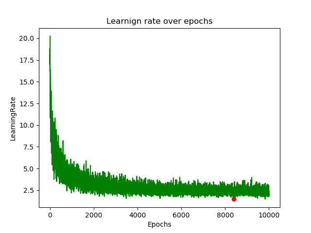

<p align="center">
  <picture>
    <source media="(prefers-color-scheme: dark)" srcset="images/charllms.webp" width=300>
    
  </picture>
  <br/>
  <br/>
</p>


# **Character-Level Language Models Repo 🕺🏽**

This repository contains multiple character-level language models (charLLM). Each language model is designed to generate text at the character level, providing a granular level of control and flexibility.


## 🌟 Available Language Models 

- **Character-Level MLP LLM (<i>First MLP LLM</i>)**
- **GPT-2 (under process)**

## Character-Level MLP

The Character-Level MLP language model is implemented based on the approach described in the paper "[A Neural Probabilistic Language Model](https://www.jmlr.org/papers/volume3/bengio03a/bengio03a.pdf)" by Bential et al. (2002). 
It utilizes a multilayer perceptron architecture to generate text at the character level.

## Installation

### With PIP

This repository is tested on Python 3.8+, and PyTorch 2.0.0+.

First, create a **virtual environment** with the version of Python you're going to use and activate it.

Then, you will need to install **PyTorch**.

When backends has been installed, CharLLMs can be installed using pip as follows:

```python
pip install charLLM
```
### With GIT 

CharLLMs can be installed using conda as follows:

```zsh
git clone https://github.com/RAravindDS/Neural-Probabilistic-Language-Model.git
```


### Quick Tour


To use the Character-Level MLP language model, follow these steps:

1. Install the package dependencies.
2. Import the `CharMLP` class from the `charLLM` module.
3. Create an instance of the `CharMLP` class.
4. Train the model on a suitable dataset.
5. Generate text using the trained model.

**Demo for NPLM**
```python 
# Import the class 
>>> from charLLM import NPLM # Neurl Probablistic Language Model 
>>> text_path = "path-to-text-file.txt" 
>>> model_parameters = {
    "block_size" :3, 
    "train_size" :0.8, 
    'epochs' :10000, 
    'batch_size' :32, 
    'hidden_layer' :100, 
    'embedding_dimension' :50,
    'learning_rate' :0.1 
    }
>>> obj = NPLM(text_path, model_parameters)  # Initialize the class 
>>> obj.train_model() 
## It outputs the val_loss and image 
>>> obj.sampling(words_needed=10) #It samples 10 tokens. 
```

<center><b>Model Output Graph<b></center>

<center></center>


Feel free to explore the repository and experiment with the different language models provided.

## Contributions

Contributions to this repository are welcome. If you have implemented a novel character-level language model or would like to enhance the existing models, please consider contributing to the project.

## License

This repository is licensed under the [MIT License](LICENCE).
